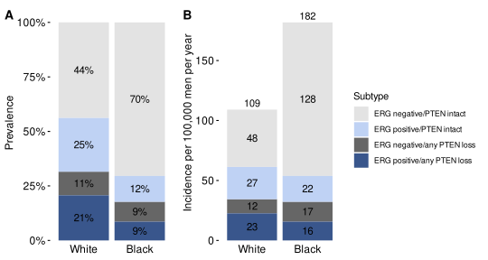
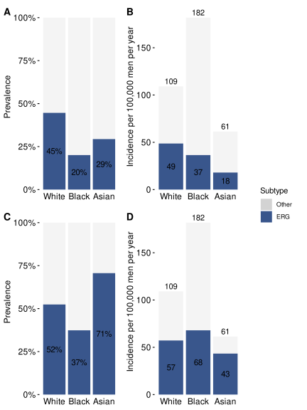
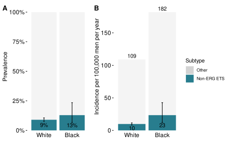

Incidence of Prostate Cancer Molecular Subtypes by Race
================
Claire Kim, Hannah Guard
Fri Feb 20, 2026 12:51:16 PM

- [Data in Text](#data-in-text)
  - [Prevalence](#prevalence)
  - [Incidence](#incidence)
- [Figures](#figures)
  - [Figure 1](#figure-1)
  - [Figure 2](#figure-2)
- [Supplementary Figures](#supplementary-figures)
  - [Supplementary Figure 1](#supplementary-figure-1)
  - [Supplementary Figure 2](#supplementary-figure-2)
  - [Supplementary Figure 3](#supplementary-figure-3)
- [Supplementary Tables](#supplementary-tables)
  - [Supplementary Table 2](#supplementary-table-2)

``` r
library(tidyverse)
library(here)
library(labelled)
library(viridis)
library(cowplot)
library(metafor)
library(rifttable)
library(scales)
knitr::opts_chunk$set(dev = "svg") # SVG, not PNG figures; also dev = "svglite"

# Load in SEER incidence data
seer_incd <- read_csv(
  file = here(
    "data",
    "SEER_Incidence.csv"
  ),
  show_col_types = FALSE
) |>
  select(race, incidence) |> 
  mutate(race = factor(race))

# Load in the TCGA data downloaded from https://www.cbioportal.org/study/summary?id=prad_tcga_pub on 7/12/2024
tcga <- read_tsv(
  file = here(
    "data", 
    "prad_tcga_pub_clinical_data_07122024.tsv"
  ),
  show_col_types = FALSE
) |>
  rename(
    patientid = `Patient ID`,
    sampleid = `Sample ID`,
    race = `Race Category`,
    subtype = Subtype
  ) |>
  select(patientid, sampleid, race, subtype)


# Generate subtype counts and prevalence for TCGA
tcga_cl <- tcga |>
  mutate(
    race = case_when(
      race == "WHITE" ~ "White",
      race == "BLACK OR AFRICAN AMERICAN" ~ "Black",
      race == "ASIAN" ~ "Asian"
    ),
    subtype = str_sub(
      string = subtype, 
      start = 3
    ),
  ) |>
  group_by(race) |>
  mutate(total = n()) |>
  ungroup() |>
  group_by(race, subtype) |>
  summarize(
    source = "TCGA 2015",
    total = mean(total, na.rm = TRUE),
    cases = n(),
    prevalence = cases / total,
    .groups = "drop"
  ) |>
  # filter to subtypes of interest and remove rows for missing race
  filter(
    subtype %in% c("ERG", "ETV1", "ETV4", "FLI1", "SPOP", "FOXA1") &
      !is.na(race)
  )


# Load Hopkins ERG PTEN data
ergpten_hopkins_cl <- read_csv(
  file = here(
    "data",
    "ERG_PTEN_Hopkins_processed.csv"
  ),
  show_col_types = FALSE
)


# Load SPOP data and generate weighted average here, then merge as for ERGxPTEN
spop <- read_csv(
  file = here(
    "data",
    "SPOP_counts.csv"
  ),
  show_col_types = FALSE
) |>
  mutate(
    prevalence = cases / total,
    scoreci(
      success = cases,
      total = total,
      level = 0.95
    ),
    # Log transform prevalence and confidence limits
    log_prevalence = log(estimate),
    log_ci_lower = log(conf.low),
    log_ci_upper = log(conf.high),
    standard_error = (log_ci_upper - log_ci_lower) / 2 / qnorm(0.975)
  ) |>
  # removing variables that are not needed
  select(-c(samples, found, prevalence, success, level))

# Generate a data frame with total counts and total SPOP positive tumors by race
# to be merged with results of meta-analysis
prev_forspop <- spop |>
  group_by(race, subtype) |>
  summarize(
    total = sum(total, na.rm = TRUE),
    events = sum(cases, na.rm = TRUE),
    .groups = "drop"
  ) |>
  select(race, subtype, total, events)

# Perform random effects meta-analysis using nested data-set 
# (single step for all three races)
spop_result <- spop |>
  # Select on variables needed for meta-analysis
  select(race, log_prevalence, standard_error) |>
  # Create nested data frame called data
  nest(data = c(-race)) |>
  mutate(
    # perform meta-analysis for each race
    result_list = map(
      .x = data,
      .f = function(df) {
        rma(
          yi = log_prevalence,
          sei = standard_error,
          method = "DL",
          data = df
        )
      }
    ),
    # Extract output from meta-analysis list
    result_df = map(
      .x = result_list,
      .f = function(a_list) {
        tibble(
          beta = a_list$beta[1],
          se = a_list$se,
          ci.lb = a_list$ci.lb,
          ci.ub = a_list$ci.ub
        )
      }
    )
  ) |>
  unnest(cols = result_df) |>
  # Transform estimates back from the log scale
  mutate(
    estimate = exp(beta),
    conf.low = exp(ci.lb),
    conf.high = exp(ci.ub),
    # Create a source variable
    source = "Meta-Analysis"
  ) |>
  # Join in data frame with total and positive tumor counts and subtype name
  left_join(prev_forspop, by = "race") |>
  select(source, race, subtype, total, events, estimate, 
         conf.low, conf.high)


# Load and prepare prevalence data
prevalence <- read_csv(
  file = here(
    "data",
    "Subtype_Prevalence.csv"
  ),
  show_col_types = FALSE
) |>
  bind_rows(tcga_cl) |>
  bind_rows(ergpten_hopkins_cl) |>
  # add second version of ERG x PTEN "Hopkins" data for any PTEN loss
  # regardless of ERG
  bind_rows(
    ergpten_hopkins_cl |>
      mutate(
        subtype = if_else(
          str_detect(
            string = subtype,
            pattern = "PTEN loss"
          ),
          true = "PTEN loss",
          false = "PTEN intact",
        ),
        source = "Hopkins collapsed"
      ) |>
      filter(subtype == "PTEN loss")
  ) |>
  # Combine non-ERG ETS upfront because we never separate them
  mutate(
    subtype = fct_collapse(
      factor(subtype),
      "Non-ERG ETS" = c(
        "ETV1",
        "ETV4",
        "FLI1"
      )
    )
  ) |>
  group_by(source, race, subtype) |>
  summarize(
    # for the newly collapsed non-ERG ETS (otherwise it is the sum of 1 row):
    prevalence = sum(prevalence, na.rm = TRUE),
    # median, mean, or whatever to select one value:
    total = median(total, na.rm = TRUE),
    zhou_lower = median(zhou_lower),
    zhou_upper = median(zhou_upper),
    # do not group the result; eliminates a message
    .groups = "drop"
  ) |>
  # Reconstruct counts and calculate confidence intervals
  mutate(
    # Rounding of counts *increases* precision of prevalence estimates
    # and their confidence intervals because the true counts, even if not
    # reported in the papers, must be integer numbers
    events = round(
      prevalence * total,
      digits = 0
    ),
    # add 95% CIs now -- we do not care about CIs for the "Other" group
    scoreci(
      success = events,
      total = total,
      level = 0.95
    ),
    # Use estimate and CI from random-effects models, not simple proportion,
    # for the meta-analysis of ERG prevalence
    estimate = if_else(
      source == "Zhou 2017",
      true = prevalence,
      false = estimate
    ),
    conf.low = if_else(
      source == "Zhou 2017",
      true = zhou_lower,
      false = conf.low
    ),
    conf.high = if_else(
      source == "Zhou 2017",
      true = zhou_upper,
      false = conf.high
    )
  ) |>
  bind_rows(spop_result) |>
  mutate(
    subtype = fct_relevel(
      subtype,
      "ERG",
      "Non-ERG ETS",
      "SPOP",
      "FOXA1",
      "ERG positive/any PTEN loss",
      "ERG negative/any PTEN loss",
      "ERG positive/PTEN intact",
      "ERG negative/PTEN intact",
      "PTEN loss"
    ),
    race = fct_relevel(
      race,
      "White",
      "Black",
      "Asian"
    )
  ) |>
  # Drop extraneous columns
  select(-zhou_lower, -zhou_upper, -success, -prevalence, -level)
```

# Data in Text

## Prevalence

Prevalence (%), with 95% confidence intervals and event counts, per
study, subtype, and race.

``` r
prevalence |>
  mutate(
    across(
      .cols = c(estimate, conf.low, conf.high),
      .fns = \(x) round(x * 100, digits = 0)
    ),
    result = paste0(
      estimate,
      "% (",
      conf.low,
      ", ",
      conf.high,
      ")<br />n = ",
      events
    )
  ) |>
  select(subtype, source, race, result) |>
  arrange(subtype) |>
  pivot_wider(
    id_cols = c(subtype, source),
    names_from = race,
    values_from = result,
    values_fill = "",
    names_sort = TRUE
  )
```

<div class="kable-table">

| subtype | source | White | Black | Asian |
|:---|:---|:---|:---|:---|
| ERG | TCGA 2015 | 49% (43, 54)<br />n = 131 | 28% (17, 43)<br />n = 12 | 50% (22, 78)<br />n = 4 |
| ERG | Zhou 2017 | 49% (45, 52)<br />n = 6508 | 25% (18, 32)<br />n = 130 | 27% (16, 41)<br />n = 663 |
| Non-ERG ETS | TCGA 2015 | 15% (11, 20)<br />n = 41 | 9% (4, 22)<br />n = 4 | 12% (2, 47)<br />n = 1 |
| Non-ERG ETS | Tomlins 2015 | 9% (8, 11)<br />n = 126 | 13% (7, 23)<br />n = 8 |  |
| SPOP | TCGA 2015 | 9% (6, 13)<br />n = 24 | 21% (11, 35)<br />n = 9 | 12% (2, 47)<br />n = 1 |
| SPOP | Meta-Analysis | 11% (8, 16)<br />n = 170 | 11% (5, 28)<br />n = 24 | 8% (4, 14)<br />n = 8 |
| FOXA1 | TCGA 2015 | 3% (2, 6)<br />n = 8 | 2% (0, 12)<br />n = 1 |  |
| ERG positive/any PTEN loss | Hopkins 2024 | 21% (16, 27)<br />n = 42 | 9% (5, 14)<br />n = 16 |  |
| ERG negative/any PTEN loss | Hopkins 2024 | 11% (7, 16)<br />n = 22 | 9% (6, 14)<br />n = 17 |  |
| ERG positive/PTEN intact | Hopkins 2024 | 25% (19, 31)<br />n = 50 | 12% (8, 17)<br />n = 22 |  |
| ERG negative/PTEN intact | Hopkins 2024 | 44% (37, 51)<br />n = 89 | 70% (64, 77)<br />n = 131 |  |
| PTEN loss | Hopkins collapsed | 32% (26, 38)<br />n = 64 | 18% (13, 24)<br />n = 33 |  |

</div>

## Incidence

Incidence per 100,000 men per year, with 95% confidence intervals, per
study, subtype, and race.

``` r
multiply_by_incidence <- function(data) {
  data |>
    left_join(
      seer_incd,
      by = "race"
    ) |>
    mutate(
      across(
        .cols = c(estimate, conf.low, conf.high),
        .fns = \(x) x * incidence
      )
    ) |>
    select(-incidence)
}

prevalence |>
  multiply_by_incidence() |>
  mutate(
    across(
      .cols = c(estimate, conf.low, conf.high),
      .fns = \(x) round(x, digits = 0)
    ),
    result = paste0(
      estimate,
      " (",
      conf.low,
      ", ",
      conf.high,
      ")"
    )
  ) |>
  select(subtype, source, race, result) |>
  arrange(subtype) |>
  pivot_wider(
    id_cols = c(subtype, source),
    names_from = race,
    values_from = result, 
    values_fill = "",
    names_sort = TRUE
  )
```

<div class="kable-table">

| subtype | source | White | Black | Asian |
|:---|:---|:---|:---|:---|
| ERG | TCGA 2015 | 53 (46, 59) | 51 (30, 78) | 31 (13, 48) |
| ERG | Zhou 2017 | 53 (49, 57) | 45 (33, 58) | 17 (10, 25) |
| Non-ERG ETS | TCGA 2015 | 17 (12, 22) | 17 (7, 39) | 8 (1, 29) |
| Non-ERG ETS | Tomlins 2015 | 10 (8, 12) | 23 (12, 43) |  |
| SPOP | TCGA 2015 | 10 (7, 14) | 38 (21, 64) | 8 (1, 29) |
| SPOP | Meta-Analysis | 12 (9, 17) | 20 (8, 51) | 5 (2, 9) |
| FOXA1 | TCGA 2015 | 3 (2, 6) | 4 (1, 22) |  |
| ERG positive/any PTEN loss | Hopkins 2024 | 23 (17, 29) | 16 (10, 25) |  |
| ERG negative/any PTEN loss | Hopkins 2024 | 12 (8, 17) | 17 (11, 26) |  |
| ERG positive/PTEN intact | Hopkins 2024 | 27 (21, 34) | 22 (14, 31) |  |
| ERG negative/PTEN intact | Hopkins 2024 | 48 (41, 55) | 128 (115, 139) |  |
| PTEN loss | Hopkins collapsed | 34 (28, 42) | 32 (23, 43) |  |

</div>

# Figures

## Figure 1

Prevalence (**A**, **C**) and incidence rates (**B**, **D**) of
molecular subtypes of prostate cancer by race, based on prevalence data
from The Cancer Genome Atlas (**A**, **B**), which included 270 White
men, 43 Black men, and 8 Asian men, or a meta-analysis of ERG prevalence
(**C**, **D**) that included 13,281 White men, 522 Black men, and 2,457
Asian men, as well as overall incidence data by race from SEER
(2017–2021). Estimates for Asian men in TCGA are suppressed because of
the very small sample. Bars in **C** and **D** are 95% confidence
intervals.

``` r
# Add prevalence for the "Other" subtype so that prevalence sums to 100%
# if desired, allowing for any number of subtypes remaining in the plot
add_other_prevalence <- function(data) {
  data |>
    group_by(source, race) |>
    summarize(
      estimate = 1 - sum(estimate),
      subtype = "Other",
      .groups = "drop",
    ) |>
    bind_rows(data) |>
    mutate(
      subtype = factor(
        subtype,
        levels = c(
          levels(data$subtype),
          "Other"
        )
      )
    )
}

# Stacked bar plots for prevalence or incidence
stacked_bar_plot <- function(
  data,
  estimand = c("prevalence", "incidence"),
  conf_int = FALSE
) {
  estimand <- match.arg(estimand)
  y_axis_label <- c(
    incidence = "Incidence per 100,000 men per year",
    prevalence = "Prevalence"
  )
  # disable transparency unless input data set for TCGA has an alpha variable
  if (!("suppress" %in% names(data))) {
    data <- data |>
      mutate(suppress = FALSE)
  }
  # disable lowering of bar labels if there is not overlap between error bar and label
  if (!("lower" %in% names(data))) {
    data <- data |>
      mutate(lower = FALSE)
  }
  if (!("lower2" %in% names(data))) {
    data <- data |>
      mutate(lower2 = FALSE)
  }
  plot <- data |>
    mutate(
      subtype = fct_rev(subtype),
      label = case_when(
        suppress == TRUE | lower == TRUE | lower2 == TRUE ~
          "",
        estimand == "prevalence" ~
          paste0(
            round(
              estimate * 100,
              digits = 0
            ),
            "%"
          ),
        estimand == "incidence" ~
          paste0(
            round(
              estimate,
              digits = 0
            )
          )
      ),
      label2 = case_when(
        suppress == TRUE | lower == FALSE ~
          "",
        estimand == "prevalence" & lower == TRUE ~
          paste0(
            round(
              estimate * 100,
              digits = 0
            ),
            "%"
          ),
        estimand == "incidence" & lower == TRUE ~
          paste0(
            round(
              estimate,
              digits = 0
            )
          )
      ),
      label3 = case_when(
        suppress == TRUE | lower2 == FALSE ~
          "",
        estimand == "prevalence" & lower2 == TRUE ~
          paste0(
            round(
              estimate * 100,
              digits = 0
            ),
            "%"
          ),
        estimand == "incidence" & lower2 == TRUE ~
          paste0(
            round(
              estimate,
              digits = 0
            )
          )
      )
    ) |>
    ggplot(
      aes(
        x = race,
        y = estimate,
        fill = subtype,
        alpha = factor(suppress)
      )
    ) +
    geom_bar(
      stat = "identity",
      position = "stack"
    ) +
    geom_text(
      aes(
        label = label
      ),
      position = position_stack(vjust = 0.5),
      size = 4
    ) +
    geom_text(
      aes(
        label = label2
      ),
      position = position_stack(vjust = 0.33),
      size = 4
    ) +
    geom_text(
      aes(
        label = label3
      ),
      position = position_stack(vjust = 0.22),
      size = 4
    ) +
    # Changing colors to be colorblind-friendly
    scale_fill_manual(
      values = c(
        Other = "lightgrey",
        FOXA1 = "#FDE725FF",
        SPOP = "#55C667FF",
        `Non-ERG ETS` = "#287D8EFF",
        ERG = "#39568CFF",
        `ERG negative/PTEN intact` = "gray89",
        `ERG positive/PTEN intact` = "#bfd2f4",
        `ERG negative/any PTEN loss` = "gray40",
        `ERG positive/any PTEN loss` = "#39568CFF"
      )
    ) +
    scale_alpha_manual(
      breaks = c(TRUE, FALSE),
      values = c(0.25, 1),
      guide = "none"
    ) +
    labs(
      y = y_axis_label[estimand],
      fill = "Subtype"
    ) +
    theme_minimal() +
    theme(
      axis.title.x = element_blank(),
      axis.ticks.y = element_line(),
      panel.grid.minor = element_blank(),
      panel.grid.major = element_blank(),
      axis.title.y = element_text(size = 12),
      axis.text = element_text(
        size = 12,
        color = "black"
      )
    )
  if (estimand == "prevalence") {
    plot <- plot +
      scale_y_continuous(
        labels = percent,
        expand = expansion(mult = c(0, 0.08))
      )
  }
  if (estimand == "incidence") {
    plot <- plot +
      scale_y_continuous(expand = expansion(mult = c(0, 0.08))) +
      geom_text(
        aes(
          label = round(after_stat(y), digits = 0),
          group = race
        ),
        stat = "summary",
        fun = sum,
        vjust = -0.25
      )
  }
  if (conf_int == TRUE) {
    plot <- plot +
      geom_errorbar(
        mapping = aes(
          ymin = conf.low,
          ymax = conf.high
        ),
        width = 0.05,
      )
  }
  plot
}

plot_grid(
  plot_grid(
    prevalence |>
      filter(source == "TCGA 2015") |>
      add_other_prevalence() |>
      mutate(
        suppress = race == "Asian"
      ) |>
      stacked_bar_plot(estimand = "prevalence") +
      theme(legend.position = "none"),
    prevalence |>
      filter(source == "TCGA 2015") |>
      add_other_prevalence() |>
      multiply_by_incidence() |>
      mutate(
        suppress = race == "Asian"
      ) |>
      stacked_bar_plot(estimand = "incidence") +
      theme(legend.position = "none"),
    prevalence |>
      filter(source == "Zhou 2017") |>
      add_other_prevalence() |>
      mutate(
        suppress = subtype == "Other"
      ) |>
      stacked_bar_plot(
        estimand = "prevalence",
        conf_int = TRUE
      ) +
      theme(legend.position = "none"),
    prevalence |>
      filter(source == "Zhou 2017") |>
      add_other_prevalence() |>
      multiply_by_incidence() |>
      mutate(
        suppress = subtype == "Other",
        lower = conf.low < (estimate / 1.5)
      ) |>
      stacked_bar_plot(
        estimand = "incidence",
        conf_int = TRUE
      ) +
      theme(legend.position = "none"),
    labels = LETTERS,
    label_size = 14,
    nrow = 2,
    label_y = 0.98
  ),
  suppressWarnings(
    get_legend(
      prevalence |>
        filter(source == "TCGA 2015") |>
        add_other_prevalence() |>
        stacked_bar_plot()
    )
  ),
  ncol = 2,
  rel_widths = c(0.8, 0.2)
)
```

<!-- -->

## Figure 2

Prevalence (**A**) and incidence (**B**) of any PTEN protein loss in
prostate tumors with or without *TMPRSS2:ERG* (measured by ERG protein
expression) among White (*n* = 203) and Black (*n* = 186) patients from
a hospital-based study at Johns Hopkins Hospital with frequency matching
of Gleason score by race, as well as SEER incidence data (2017–2021).

``` r
plot_grid(
  plot_grid(
    prevalence |>
      filter(source == "Hopkins 2024") |>
      stacked_bar_plot(estimand = "prevalence") +
      theme(legend.position = "none"),
    prevalence |>
      filter(source == "Hopkins 2024") |>
      multiply_by_incidence() |>
      stacked_bar_plot(estimand = "incidence") +
      theme(legend.position = "none"),
    labels = LETTERS,
    label_size = 14,
    nrow = 1,
    label_y = 0.98,
    rel_widths = c(1, 0.94)
  ),
  suppressWarnings(
    get_legend(
      prevalence |>
        filter(source == "Hopkins 2024") |>
        stacked_bar_plot()
    )
  ),
  ncol = 2,
  rel_widths = c(0.9, 0.37)
)
```

<!-- -->

# Supplementary Figures

## Supplementary Figure 1

Lower 80% confidence limits (**A**, **B**) and upper 80% confidence
limits (**C**, **D**) for prevalence (**A**, **C**) and incidence rates
(**B**, **D**) of ERG-positive prostate cancer by race. 80% instead of
95% confidence intervals are chosen to depict the sampling variability
even in a non-extreme scenario. With the small samples sizes for racial
minorities in The Cancer Genome Atlas (270 White men, 43 Black men, 8
Asian men), these estimates highlight the limited precision of TCGA data
alone that could lead to different conclusions about incidence rates of
subtypes by race, even for the most common subtype with *TMPRSS2:ERG*
fusions.

``` r
# Calculate 80% CIs for TCGA
prevalence_tcga_ci80 <- prevalence |>
  filter(source == "TCGA 2015" & subtype == "ERG") |>
  select(-estimate, -conf.low, -conf.high) |>
  mutate(
    scoreci(
      success = events,
      total = total,
      level = 0.8
    )
  ) |>
  # Drop extraneous columns
  select(source, race, subtype, conf.low, conf.high) |>
  pivot_longer(
    cols = c(conf.low, conf.high),
    names_to = "limit",
    values_to = "estimate"
  ) |>
  # Variables that need to exist for stacked_bar_plot(), even if empty:
  mutate(
    conf.low = NA,
    conf.high = NA
  )

plot_grid(
  plot_grid(
    prevalence_tcga_ci80 |>
      filter(limit == "conf.low") |>
      add_other_prevalence() |>
      mutate(suppress = subtype == "Other") |>
      stacked_bar_plot(estimand = "prevalence") +
      theme(legend.position = "none"),
    prevalence_tcga_ci80 |>
      filter(limit == "conf.low") |>
      add_other_prevalence() |>
      multiply_by_incidence() |>
      mutate(suppress = subtype == "Other") |>
      stacked_bar_plot(estimand = "incidence") +
      theme(legend.position = "none"),
    prevalence_tcga_ci80 |>
      filter(limit == "conf.high") |>
      add_other_prevalence() |>
      mutate(suppress = subtype == "Other") |>
      stacked_bar_plot(estimand = "prevalence") +
      theme(legend.position = "none"),
    prevalence_tcga_ci80 |>
      filter(limit == "conf.high") |>
      add_other_prevalence() |>
      multiply_by_incidence() |>
      mutate(suppress = subtype == "Other") |>
      stacked_bar_plot(estimand = "incidence") +
      theme(legend.position = "none"),
    labels = LETTERS,
    label_size = 14,
    nrow = 2,
    label_y = 0.98
  ),
  suppressWarnings(
    get_legend(
      prevalence_tcga_ci80 |>
        filter(source == "TCGA 2015") |>
        add_other_prevalence() |>
        stacked_bar_plot()
    )
  ),
  ncol = 2,
  rel_widths = c(0.8, 0.2)
)
```

<!-- -->

## Supplementary Figure 2

Prevalence (**A**) and incidence (**B**) of non-*ERG* ETS (*ETV1*,
*ETV4*, and *FLI1*) molecular subtypes with 95% confidence limits based
on prevalence data by Tomlins *et al.* (2015) among White (*n* = 1400)
and Black (*n* = 62) men as well as SEER incidence data (2017–2021).

``` r
plot_grid(
  plot_grid(
    prevalence |>
      filter(source == "Tomlins 2015") |>
      add_other_prevalence() |>
      mutate(
        suppress = subtype == "Other",
        lower = conf.low < (estimate / 1.4)
      ) |>
      stacked_bar_plot(
        estimand = "prevalence",
        conf_int = TRUE
      ) +
      theme(legend.position = "none"),
    prevalence |>
      filter(source == "Tomlins 2015") |>
      add_other_prevalence() |>
      multiply_by_incidence() |>
      mutate(
        suppress = subtype == "Other",
        lower = TRUE
      ) |>
      stacked_bar_plot(
        estimand = "incidence",
        conf_int = TRUE
      ) +
      theme(legend.position = "none"),
    labels = LETTERS,
    label_size = 14,
    nrow = 1,
    label_y = 0.98
  ),
  suppressWarnings(
    get_legend(
      prevalence |>
        filter(source == "Tomlins 2015") |>
        add_other_prevalence() |>
        stacked_bar_plot()
    )
  ),
  ncol = 2,
  rel_widths = c(0.8, 0.2)
)
```

<!-- -->

## Supplementary Figure 3

Prevalence (**A**) and incidence (**B**) of the SPOP molecular subtype
with 95% confidence limits. Prevalence by race was estimated with
meta-analyses using DerSimonian-Laird random-effects models, based on
data from Yuan *et al.* (2020, for White and Black men in TCGA),
Blattner *et al.* (2014), Stopsack *et al.* (2022, localized disease at
sampling only), and Khani *et al.* (2014) among White men (1346
patients, 5 studies) and Black men (203 patients, 3 studies). For Asian
men, data were too sparse (see [Supplementary Table
2](#supplementary-table-2)). Overall race-specific incidence data are
from SEER (2017–2021).

``` r
plot_grid(
  plot_grid(
    prevalence |>
      filter(source == "Meta-Analysis") |>
      filter(race != "Asian") |> 
      add_other_prevalence() |>
      mutate(
        suppress = subtype == "Other",
        lower2 = conf.low < (estimate / 1.4)
      ) |>
      stacked_bar_plot(
        estimand = "prevalence",
        conf_int = TRUE
      ) +
      theme(legend.position = "none"),
    prevalence |>
      filter(source == "Meta-Analysis") |>
      filter(race != "Asian") |> 
      add_other_prevalence() |>
      multiply_by_incidence() |>
      mutate(
        suppress = subtype == "Other",
        lower2 = conf.low < (estimate / 1.5), 
        lower = conf.low < (estimate) / 1.2 & conf.low > (estimate / 1.5)
      ) |>
      stacked_bar_plot(
        estimand = "incidence",
        conf_int = TRUE
      ) +
      theme(legend.position = "none"),
    labels = LETTERS,
    label_size = 14,
    nrow = 1,
    label_y = 0.98
  ),
  suppressWarnings(
    get_legend(
      prevalence |>
        filter(source == "Meta-Analysis") |>
        add_other_prevalence() |>
        stacked_bar_plot()
    )
  ),
  ncol = 2,
  rel_widths = c(0.8, 0.2)
)
```

<!-- -->

# Supplementary Tables

## Supplementary Table 2

Prevalence estimates on the SPOP molecular subtype (with Wilson’s 95%
confidence limits) and counts of altered/total tumor samples per race,
from Yuan *et al.* (2020, for White and Black men in TCGA), TCGA (2015,
data for Asian men in TCGA retrieved via cBioPortal), Blattner *et al.*
(2014), Stopsack *et al.* (2022, localized disease at sampling only),
and Khani *et al.* (2014) among White (*n* = 1346), Black (*n* = 203),
and Asian men (*n* = 111). Data for Asian men were not meta-analyzed due
to small sample sizes.

``` r
spop |>
  mutate(
    across(
      .cols = c(estimate, conf.low, conf.high),
      .fns = \(x) round(x * 100, digits = 0)
    ),
    result = paste0(
      estimate,
      "% (",
      conf.low,
      ", ",
      conf.high,
      "),<br />n/total = ",
      cases,
      "/",
      total
    )
  ) |>
  mutate(
    flag = case_when(
      cohort == "Weill Cornell Medical College cohort" ~ 1,
      TRUE ~ 0
    )
  ) |>
  select(subtype, source, flag, race, result) |>
  arrange(subtype) |>
  pivot_wider(
    id_cols = c(subtype, source, flag),
    names_from = race,
    values_from = result,
    values_fill = ""
  ) |>
  rename(
    Source = source,
  ) |>
  select(-flag, -subtype)
```

<div class="kable-table">

| Source | White | Black | Asian |
|:---|:---|:---|:---|
| Yuan 2020 | 9% (7, 12),<br />n/total = 38/414 | 23% (14, 35),<br />n/total = 14/61 |  |
| TCGA 2015 |  |  | 12% (2, 47),<br />n/total = 1/8 |
| Blattner 2014 | 6% (3, 13),<br />n/total = 6/99 |  | 7% (3, 14),<br />n/total = 6/87 |
| Blattner 2014 | 14% (9, 22),<br />n/total = 18/125 |  |  |
| Stopsack 2022 | 16% (13, 19),<br />n/total = 100/630 | 11% (5, 22),<br />n/total = 6/54 | 6% (1, 28),<br />n/total = 1/16 |
| Khani 2014 | 10% (5, 19),<br />n/total = 8/78 | 5% (2, 11),<br />n/total = 4/88 |  |

</div>

``` r
sessioninfo::session_info()
```

    ## ─ Session info ───────────────────────────────────────────────────────────────
    ##  setting  value
    ##  version  R version 4.4.1 (2024-06-14)
    ##  os       Ubuntu 22.04.3 LTS
    ##  system   x86_64, linux-gnu
    ##  ui       X11
    ##  language (EN)
    ##  collate  en_US.UTF-8
    ##  ctype    en_US.UTF-8
    ##  tz       EST5EDT
    ##  date     2026-02-20
    ##  pandoc   3.2 @ /usr/bin/ (via rmarkdown)
    ## 
    ## ─ Packages ───────────────────────────────────────────────────────────────────
    ##  package     * version    date (UTC) lib source
    ##  bit           4.5.0      2024-09-20 [1] RSPM (R 4.4.0)
    ##  bit64         4.5.2      2024-09-22 [1] RSPM (R 4.4.0)
    ##  cli           3.6.3      2024-06-21 [2] RSPM (R 4.4.0)
    ##  colorspace    2.1-1      2024-07-26 [1] RSPM (R 4.4.0)
    ##  cowplot     * 1.1.3      2024-01-22 [1] RSPM (R 4.4.0)
    ##  crayon        1.5.3      2024-06-20 [2] RSPM (R 4.4.0)
    ##  digest        0.6.37     2024-08-19 [1] RSPM (R 4.4.0)
    ##  dplyr       * 1.1.4      2023-11-17 [2] RSPM (R 4.4.0)
    ##  evaluate      1.0.1      2024-10-10 [1] RSPM (R 4.4.0)
    ##  fansi         1.0.6      2023-12-08 [2] RSPM (R 4.4.0)
    ##  farver        2.1.2      2024-05-13 [2] RSPM (R 4.4.0)
    ##  fastmap       1.2.0      2024-05-15 [2] RSPM (R 4.4.0)
    ##  forcats     * 1.0.0      2023-01-29 [2] RSPM (R 4.4.0)
    ##  generics      0.1.3      2022-07-05 [2] RSPM (R 4.4.0)
    ##  ggplot2     * 3.5.1      2024-04-23 [2] RSPM (R 4.4.0)
    ##  glue          1.8.0      2024-09-30 [1] RSPM (R 4.4.0)
    ##  gridExtra     2.3        2017-09-09 [1] RSPM (R 4.4.0)
    ##  gtable        0.3.6      2024-10-25 [1] RSPM (R 4.4.0)
    ##  haven         2.5.4      2023-11-30 [2] RSPM (R 4.4.0)
    ##  here        * 1.0.1      2020-12-13 [2] RSPM (R 4.4.0)
    ##  highr         0.11       2024-05-26 [2] RSPM (R 4.4.0)
    ##  hms           1.1.3      2023-03-21 [2] RSPM (R 4.4.0)
    ##  htmltools     0.5.8.1    2024-04-04 [2] RSPM (R 4.4.0)
    ##  knitr         1.48       2024-07-07 [1] RSPM (R 4.4.0)
    ##  labeling      0.4.3      2023-08-29 [2] RSPM (R 4.4.0)
    ##  labelled    * 2.13.0     2024-04-23 [1] RSPM (R 4.4.0)
    ##  lattice       0.22-6     2024-03-20 [3] CRAN (R 4.4.1)
    ##  lifecycle     1.0.4      2023-11-07 [2] RSPM (R 4.4.0)
    ##  lubridate   * 1.9.3      2023-09-27 [2] RSPM (R 4.4.0)
    ##  magrittr      2.0.3      2022-03-30 [2] RSPM (R 4.4.0)
    ##  mathjaxr      1.6-0      2022-02-28 [1] RSPM (R 4.4.0)
    ##  Matrix      * 1.7-0      2024-04-26 [3] CRAN (R 4.4.1)
    ##  metadat     * 1.2-0      2022-04-06 [1] RSPM (R 4.4.0)
    ##  metafor     * 4.6-0      2024-03-28 [1] RSPM (R 4.4.0)
    ##  munsell       0.5.1      2024-04-01 [2] RSPM (R 4.4.0)
    ##  nlme          3.1-165    2024-06-06 [3] RSPM (R 4.4.0)
    ##  numDeriv    * 2016.8-1.1 2019-06-06 [1] RSPM (R 4.4.0)
    ##  pillar        1.9.0      2023-03-22 [2] RSPM (R 4.4.0)
    ##  pkgconfig     2.0.3      2019-09-22 [2] RSPM (R 4.4.0)
    ##  purrr       * 1.0.2      2023-08-10 [2] RSPM (R 4.4.0)
    ##  R6            2.5.1      2021-08-19 [2] RSPM (R 4.4.0)
    ##  readr       * 2.1.5      2024-01-10 [2] RSPM (R 4.4.0)
    ##  rifttable   * 0.7.2      2026-01-18 [1] CRAN (R 4.4.1)
    ##  rlang         1.1.4      2024-06-04 [2] RSPM (R 4.4.0)
    ##  rmarkdown     2.28       2024-08-17 [1] RSPM (R 4.4.0)
    ##  rprojroot     2.0.4      2023-11-05 [2] RSPM (R 4.4.0)
    ##  rstudioapi    0.17.1     2024-10-22 [1] RSPM (R 4.4.0)
    ##  scales      * 1.3.0      2023-11-28 [2] RSPM (R 4.4.0)
    ##  sessioninfo   1.2.2      2021-12-06 [2] RSPM (R 4.4.0)
    ##  stringi       1.8.4      2024-05-06 [2] RSPM (R 4.4.0)
    ##  stringr     * 1.5.1      2023-11-14 [2] RSPM (R 4.4.0)
    ##  tibble      * 3.2.1      2023-03-20 [2] RSPM (R 4.4.0)
    ##  tidyr       * 1.3.1      2024-01-24 [2] RSPM (R 4.4.0)
    ##  tidyselect    1.2.1      2024-03-11 [2] RSPM (R 4.4.0)
    ##  tidyverse   * 2.0.0      2023-02-22 [2] RSPM (R 4.4.0)
    ##  timechange    0.3.0      2024-01-18 [2] RSPM (R 4.4.0)
    ##  tzdb          0.4.0      2023-05-12 [2] RSPM (R 4.4.0)
    ##  utf8          1.2.4      2023-10-22 [2] RSPM (R 4.4.0)
    ##  vctrs         0.6.5      2023-12-01 [2] RSPM (R 4.4.0)
    ##  viridis     * 0.6.5      2024-01-29 [1] RSPM (R 4.4.0)
    ##  viridisLite * 0.4.2      2023-05-02 [2] RSPM (R 4.4.0)
    ##  vroom         1.6.5      2023-12-05 [2] RSPM (R 4.4.0)
    ##  withr         3.0.2      2024-10-28 [1] RSPM (R 4.4.0)
    ##  xfun          0.48       2024-10-03 [1] RSPM (R 4.4.0)
    ##  yaml          2.3.10     2024-07-26 [1] RSPM (R 4.4.0)
    ## 
    ##  [1] /n/home07/hguard/R/ifxrstudio/RELEASE_3_19
    ##  [2] /usr/local/lib/R/site-library
    ##  [3] /usr/local/lib/R/library
    ## 
    ## ──────────────────────────────────────────────────────────────────────────────
